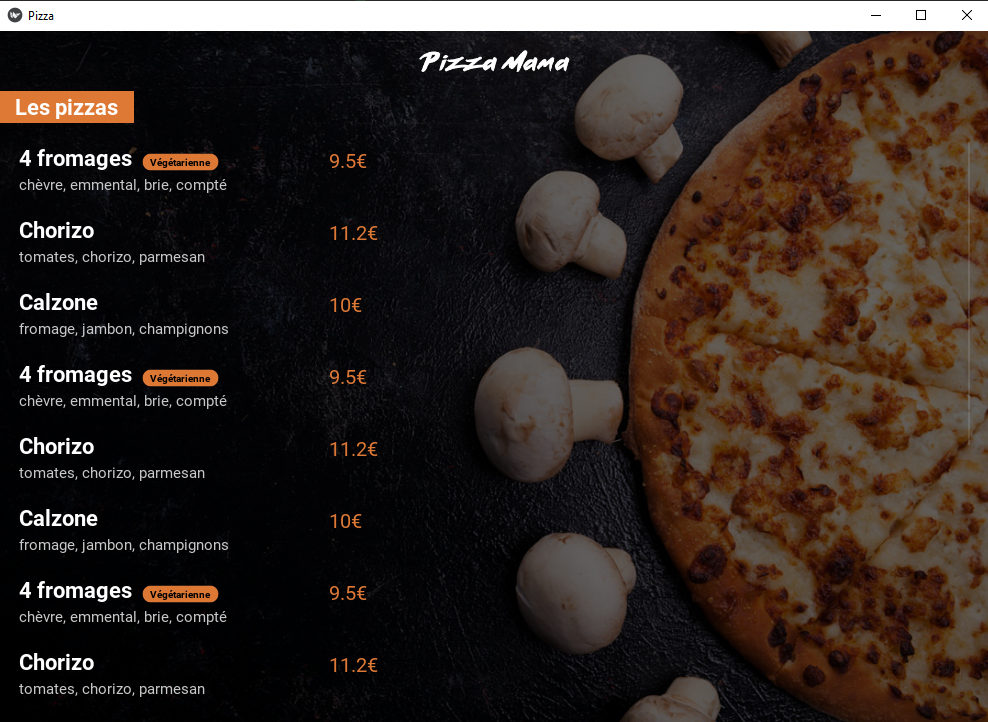

# Kivy pizza project

Ce projet à pour but de monter en compétences sur la création d'application en Python utilisant la bibliothèque
cross-plateform [kivy](https://kivy.org/#home)
Ici, on met en place une application pour afficher la carte de pizza d'un restaurant

## Screenshot

## Fonctionnalités
- Affichage des pizzas, composition, prix et tag si végétarien
- Scroll de la liste des pizzas
- Responsive design
- Interaction souris et tactile

> Les images utilisées sont reprisent d'un autre projet